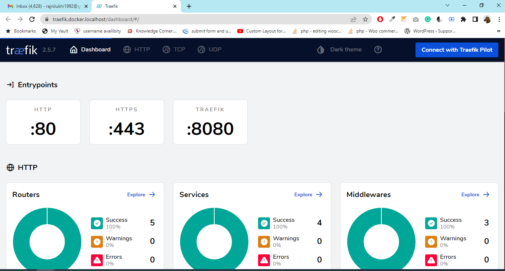

# Traefik v2 HTTPS (SSL) on localhost




To get started, just clone this repo:

```
git clone https://github.com/rnpatel1992/demotraefic.git
```


Next, go to the root of the repo and generate certificates using [mkcert](https://github.com/FiloSottile/mkcert) :

```bash
# If it's the firt install of mkcert, run
mkcert -install

# Generate certificate for domain "docker.localhost", "domain.local" and their sub-domains
mkcert -cert-file certs/local-cert.pem -key-file certs/local-key.pem "docker.localhost" "*.docker.localhost" "domain.local" "*.domain.local"
```


Create networks that will be used by Traefik:

```bash
docker network create proxy
``` 


Now, start containers with : 

```bash
# Start Traefik
docker-compose -f docker-compose.yml up -d
```


You can now go to your browser at [whoami.docker.localhost](https://whoami.docker.localhost), 

*Note: you can access to Træfik dashboard at: [traefik.docker.localhost](https://traefik.docker.localhost)*